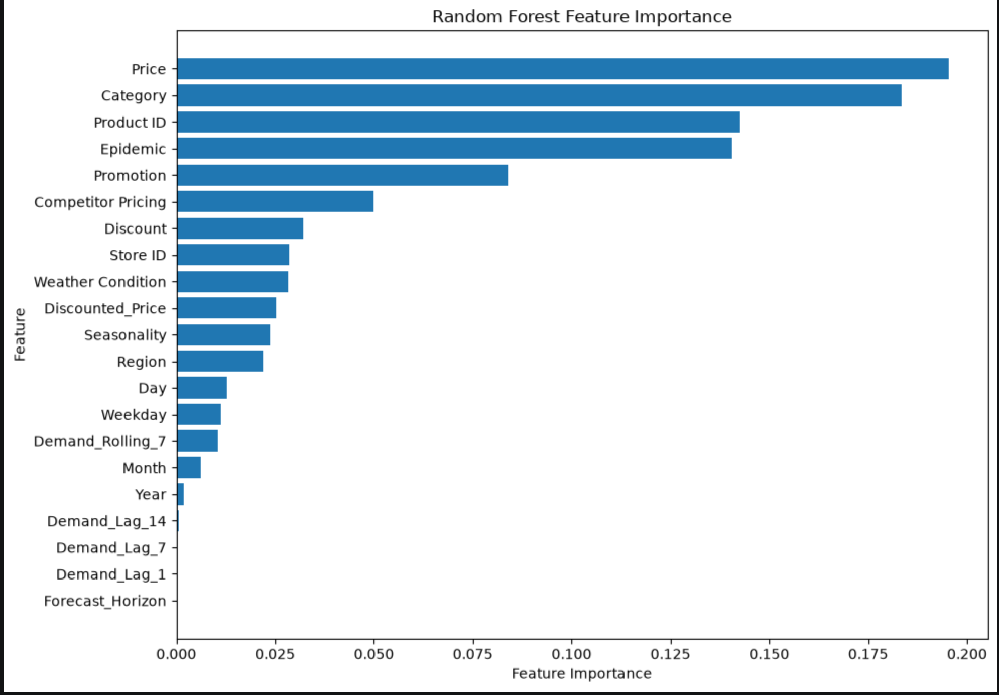
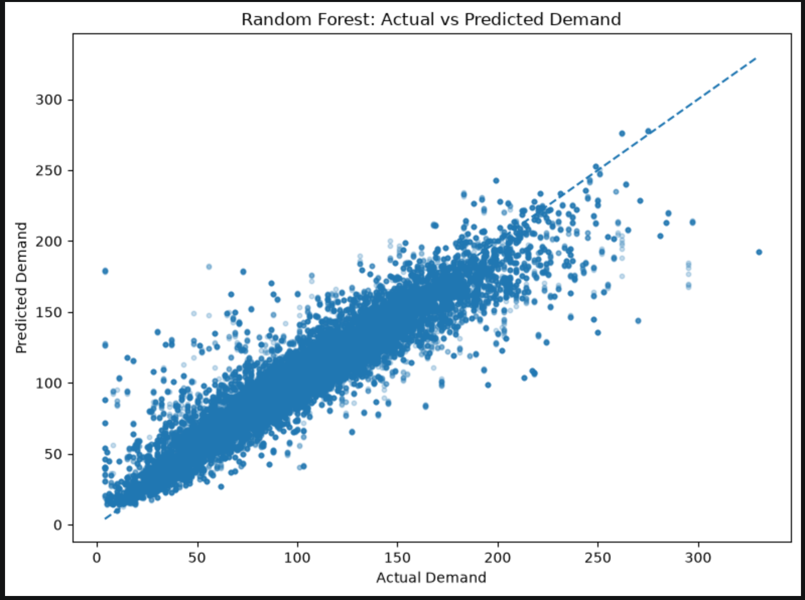

# Retail Demand Forecasting for Inventory Planning

## Project Overview

This project develops a machine learning solution for forecasting daily retail demand at store-product level across a 1–7 day forecast horizon.

The goal is to support short-term inventory and replenishment planning by estimating future product demand using historical demand patterns together with pricing, promotional, product, seasonal, weather, competitor, and calendar information.

The project follows an end-to-end workflow from exploratory data analysis and leakage-safe feature engineering through model development, chronological validation, model comparison, interpretation, and error analysis.

> **Project status:** Machine learning modelling complete. Interactive inventory-planning application in development.

---

## Business Problem

Retail inventory decisions require businesses to anticipate demand early enough to replenish stock while avoiding both stockouts and excess inventory.

The central business question addressed in this project is:

**Can historical demand and forecast-date business conditions be used to accurately forecast store-product demand over the next seven days?**

The resulting forecasts are intended to provide a foundation for short-term inventory planning, where predicted demand can later be combined with inventory levels, supplier lead times, safety stock, and other operational constraints.

---

## Dataset

The dataset contains retail demand observations at store-product-date level together with information including:

- product and category
- store and region
- demand
- price and discounts
- promotions
- competitor pricing
- weather conditions
- seasonality
- epidemic conditions
- calendar information

The original dataset was obtained from the **Onurbltc DemandForecastingDataset** repository.

The source dataset is not redistributed in this repository. Instructions for obtaining the data are provided in [`data/README.md`](data/README.md).

---

## Project Workflow

### 1. Exploratory Data Analysis

The analysis notebook investigates:

- demand distribution
- variation across products and categories
- pricing and discount relationships
- promotional effects
- weather and seasonal conditions
- temporal demand patterns
- product-level seasonality

Potential predictors were also assessed based on whether they would realistically be available at forecast time.

Variables such as same-period units sold and units ordered were excluded from the predictive feature set to avoid using information that would not be available when forecasting future demand.

---

### 2. Feature Engineering

Historical demand information was transformed into forecasting features separately for each store-product series.

Features included:

- 1-day demand lag
- 7-day demand lag
- 14-day demand lag
- 7-day rolling demand
- calendar variables
- discounted price
- forecast horizon
- pricing and promotional variables
- product/store information
- external and seasonal conditions

Historical demand features were constructed using only information observed before the forecast date to reduce the risk of target leakage.

---

### 3. Forecast Construction

The modelling dataset was restructured so that each observation represents a forecast for a specific future date.

Seven forecast horizons were created:

- Day 1
- Day 2
- Day 3
- Day 4
- Day 5
- Day 6
- Day 7

This allows a single model to learn demand patterns across the complete 7-day forecasting window.

---

## Model Validation

Because this is a forecasting problem, the data was split **chronologically rather than randomly**.

The final three months were reserved as an unseen test period.

A 7-day separation was maintained between the latest training forecast origins and the test period to prevent training targets from overlapping with future test observations.

Categorical variables were one-hot encoded using categories learned only from the training data.

---

## Models Evaluated

Four forecasting approaches were evaluated:

1. Rolling-demand baseline
2. Linear Regression
3. Random Forest
4. XGBoost

Random Forest was subsequently subjected to hyperparameter tuning to determine whether its performance could be improved further.

---

## Model Performance

| Model | MAE | RMSE | R² |
|---|---:|---:|---:|
| Baseline | 34.46 | 43.98 | 0.01 |
| Linear Regression | 26.18 | 33.71 | 0.42 |
| **Random Forest** | **9.52** | **15.30** | **0.88** |
| XGBoost | 12.06 | 17.36 | 0.85 |
| Tuned Random Forest | 12.50 | 18.39 | 0.83 |


### Final Model

**Random Forest was selected as the final forecasting model.**

It achieved:

- **MAE:** 9.52 units
- **RMSE:** 15.30 units
- **R²:** 0.88

Random Forest substantially outperformed the baseline and Linear Regression and also performed better than XGBoost.

Hyperparameter tuning did not improve performance. The tuned model produced an MAE of 12.50 and R² of 0.83, so the original Random Forest was retained based on its stronger performance on unseen future data.

---

## Forecast Horizon Performance

Random Forest performance remained highly consistent across all seven forecast horizons.

There was no substantial deterioration between next-day predictions and forecasts made seven days ahead.

This stability supports the use of the model for short-term weekly demand planning rather than limiting its use to only next-day forecasting.

---

## Key Demand Drivers

Random Forest feature importance showed that the model relied most strongly on:

- Price
- Category
- Product ID
- Epidemic conditions
- Promotion
- Competitor pricing
- Discounts
- Store
- Weather conditions
- Seasonality and region

### Random Forest Feature Importance



Historical demand lags contributed relatively less importance in this particular dataset.

Feature importance describes how strongly the model uses variables for prediction and should not be interpreted as evidence of causal relationships.

---

## Error Analysis

The final Random Forest showed very little overall directional bias:

### Actual vs Predicted Demand



**Mean forecast error: -0.35 units**

Residual analysis showed errors on both sides of zero, indicating that the model does not consistently overpredict or underpredict demand.

The largest errors were concentrated around extreme demand observations.

In particular, the model sometimes:

- overpredicted unusually low demand; and
- underpredicted unusually high demand.

These extreme-demand situations represent the primary forecasting risk for operational inventory decisions.

---

## Business Recommendations

The model could support weekly replenishment and short-term stocking decisions by providing store-product demand forecasts across a seven-day planning horizon.

For operational use:

- incorporate planned pricing, promotions, discounts, and relevant external conditions when generating forecasts;
- perform inventory planning at store-product level because demand behaviour differs across products and categories;
- combine forecast demand with available inventory, supplier lead times, safety stock, and service-level requirements;
- apply additional caution to unusually high or low demand situations;
- monitor forecasting accuracy over time; and
- retrain the model when demand patterns or predictive performance change materially.

---

## Tools & Technologies

- Python
- Pandas
- NumPy
- Matplotlib
- Seaborn
- Scikit-learn
- XGBoost
- Jupyter Notebook
- VS Code

---

## Repository Structure

```text
Demand forecasting/
│
├── data/
│   └── README.md
│
├── images/
│
├── 01_analysis.ipynb
├── 02_machine_learning.ipynb
├── .gitignore
└── README.md